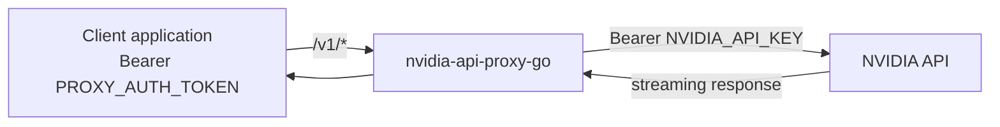

<div align="center">

# nvidia-api-proxy-go

*Keep your NVIDIA API key behind a token you control*

[](https://go.dev/)
[](go.mod)
[](proxy.go)

[Features](#features) · [Quick start](#quick-start) · [Configuration](#configuration) · [Endpoints](#endpoints) · [Deploy](#deploy-to-render) · [Development](#development)

</div>

A small, standard-library-only Go reverse proxy for the [NVIDIA API](https://docs.api.nvidia.com/). Client applications call the proxy with your own bearer token. The proxy replaces that token with the real NVIDIA API key before forwarding requests upstream.



## Features

- **Key isolation** keeps `NVIDIA_API_KEY` on the server.
- **Drop-in routing** preserves `/v1/*` paths and query strings.
- **Streaming responses** flush each chunk, including server-sent events.
- **Bearer authentication** compares SHA-256 digests in constant time.
- **Timeout controls** bound upstream pre-response and per-chunk idle time.
- **Cancellation** stops upstream work when a client disconnects.
- **Header safety** strips hop-by-hop fields and preserves response cookies.
- **Graceful shutdown** handles `SIGTERM` for zero-downtime deployments.
- **Zero dependencies** uses only the Go standard library.

## Quick start

### Prerequisites

- Go 1.24 or newer
- An NVIDIA API key
- A long, random token for proxy clients

### Run locally

From the project directory:

```bash
export NVIDIA_BASE_URL="https://integrate.api.nvidia.com/v1"
export NVIDIA_API_KEY="nvapi-..."
export PROXY_AUTH_TOKEN="your-proxy-token"

go run .
```

The server listens on port `10000` by default.

Check its configuration status:

```bash
curl http://localhost:10000/health
```

```json
{"status":"ok"}
```

Call the proxy with the token issued to clients:

```bash
curl http://localhost:10000/v1/chat/completions \
  -H "Authorization: Bearer your-proxy-token" \
  -H "Content-Type: application/json" \
  -d '{
    "model": "meta/llama-3.1-8b-instruct",
    "messages": [{"role": "user", "content": "Hello"}],
    "stream": false
  }'
```

> [!TIP]
> Existing OpenAI-compatible clients can use `http://localhost:10000/v1` as the base URL and `PROXY_AUTH_TOKEN` as the API key.

## Configuration

| Variable | Required | Default | Purpose |
|---|---:|---|---|
| `NVIDIA_BASE_URL` | yes | — | Upstream base URL. Only its scheme and host are used. |
| `NVIDIA_API_KEY` | for proxying | — | Real NVIDIA key sent upstream as a bearer token. |
| `PROXY_AUTH_TOKEN` | for proxying | — | Token that clients must send to this proxy. |
| `PORT` | no | `10000` | Listening port. Use `0` to let the operating system choose one. |
| `UPSTREAM_CONNECT_TIMEOUT_SECONDS` | no | `30` | Bounds connection, upload, and response-header acquisition. `0` disables it. |
| `UPSTREAM_IDLE_TIMEOUT_SECONDS` | no | `120` | Bounds silence between streamed chunks. `0` disables it. |

> [!IMPORTANT]
> The process requires a valid `NVIDIA_BASE_URL` at startup. Missing credentials do not stop startup, but `/health` and authenticated proxy requests return `503`.

> [!NOTE]
> The base URL path is intentionally ignored. A configured base of `https://integrate.api.nvidia.com/v1` and `https://integrate.api.nvidia.com` produce the same upstream routes.

## Endpoints

| Route | Authentication | Behavior |
|---|---|---|
| `ANY /health` | none | Returns `200 {"status":"ok"}` when configured, otherwise `503 {"status":"unconfigured"}`. |
| `ANY /v1/*` | `Authorization: Bearer <PROXY_AUTH_TOKEN>` | Forwards the normalized path, raw query, method, body, and safe headers upstream. |
| `ANY /v1`, `ANY /v1/` | none | Returns `404 {"error":"Not found"}`. |
| Any other path | none | Returns `404 {"error":"Not found"}`. |

Upstream failures return a fixed, safe response:

```json
{"error":"Bad gateway"}
```

No upstream URL, DNS detail, or credential is included in the response.

## Runtime behavior

### Path mapping

The incoming path controls the upstream route:

```text
client:   /v1/chat/completions?stream=true
base:     https://integrate.api.nvidia.com/v1
upstream: https://integrate.api.nvidia.com/v1/chat/completions?stream=true
```

Literal and encoded dot segments are normalized before routing and forwarding. Encoded slashes, repeated slashes, and raw query strings remain intact.

### Streaming

Response bodies are copied without whole-response buffering. Each received chunk is written and flushed before the next read. The idle timeout resets after every chunk, so active streams can run longer than the timeout.

### Upstream timeout

`UPSTREAM_CONNECT_TIMEOUT_SECONDS` covers the complete pre-response phase:

1. DNS resolution
2. TCP and TLS connection
3. Request-body upload
4. Response-header acquisition

The timer stops when response headers arrive, so it does not limit the lifetime of the response body.

### Disconnect and shutdown

- A downstream disconnect cancels the corresponding upstream request.
- Truncated or idle-terminated responses are aborted instead of ending cleanly with partial data.
- `SIGTERM` starts a bounded graceful shutdown through `http.Server.Shutdown`.

## Architecture

| File | Responsibility |
|---|---|
| `config.go` | Environment parsing, validation, defaults, and duration limits. |
| `main.go` | Listener startup, signal handling, and graceful shutdown. |
| `proxy.go` | Routing, authentication state, upstream request lifecycle, and response forwarding. |
| `proxy_headers.go` | Hop-by-hop filtering, cookies, encoding, and content framing. |
| `proxy_stream.go` | Gzip decoding, pooled buffers, flushing, and idle timeouts. |

The service uses one `main` package and one shared `http.Client`. `NewHandler` captures an immutable configuration snapshot and a precomputed proxy-token digest.

> [!NOTE]
> Detailed architecture and verification evidence live in [`specs/tech-architecture/`](specs/tech-architecture/).

## Deploy to Render

The repository includes a [`render.yaml`](render.yaml) blueprint with:

- Go runtime
- `CGO_ENABLED=0 GOOS=linux GOARCH=amd64 go build -trimpath -o app .` as the build command
- `/health` as the health-check path
- NVIDIA base URL, port, and timeout defaults
- `NVIDIA_API_KEY` and `PROXY_AUTH_TOKEN` as required secrets

Commit the project to a Git provider, then choose **Render → New → Blueprint** and select the repository. Enter the two secret values when prompted.

For an existing Render CLI session, run:

```bash
render blueprint launch
```

> [!WARNING]
> Anyone who obtains `PROXY_AUTH_TOKEN` can spend the configured NVIDIA quota. Generate a long random token, distribute it only to trusted clients, and rotate it when exposure is suspected.

## Development

Run the complete local verification stack:

```bash
go test ./...
go vet ./...
go build ./...
```

Run focused HTTP behavior tests:

```bash
go test -run 'TestProxyRouting|TestConnectTimeout|TestIdleTimeout' ./...
```

Build one executable per target operating system:

```bash
mkdir -p dist

# Termux on Android ARM64
CGO_ENABLED=0 GOOS=android GOARCH=arm64 \
  go build -trimpath -o dist/nvidia-api-proxy-go-termux-arm64 .

# Linux AMD64, including Render
CGO_ENABLED=0 GOOS=linux GOARCH=amd64 \
  go build -trimpath -o dist/nvidia-api-proxy-go-linux-amd64 .
```

Run the Termux build:

```bash
./dist/nvidia-api-proxy-go-termux-arm64
```

Run the Linux build on Linux:

```bash
./dist/nvidia-api-proxy-go-linux-amd64
```

Each output is one application file. The Linux executable is statically linked. The Android executable uses Android's system linker. Go builds are OS-specific; one executable cannot run on both Termux and Linux.
